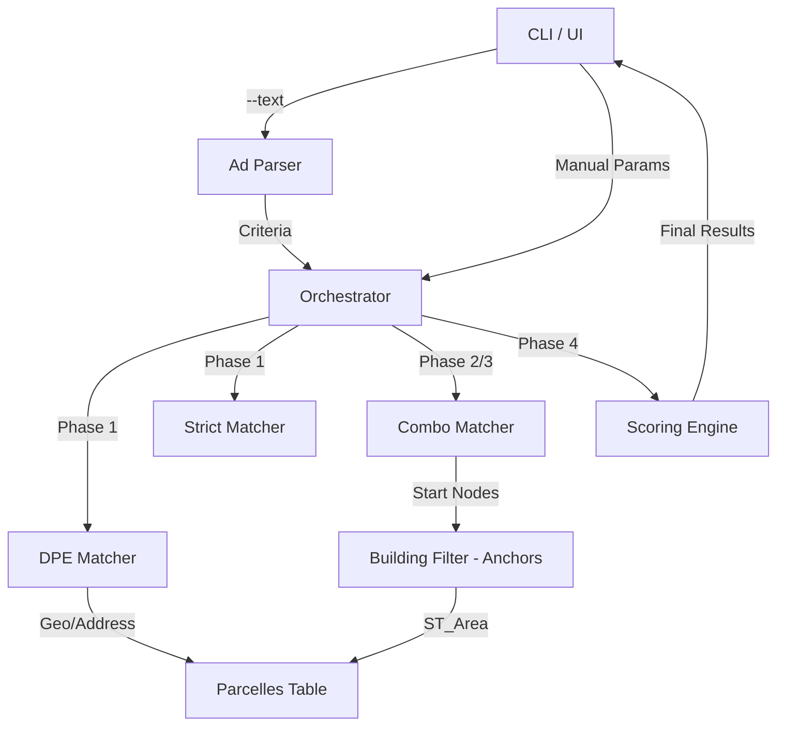

# Requirements

### Overview & Goals
The goal is to optimize the cadastral search algorithm by breaking down the `doc/plan.md` strategy into actionable tasks. This improvement focuses on using DPE (Diagnostic de Performance Énergétique) data as a high-confidence "cheat code" and implementing "Anchor Parcel" logic to better handle large properties with multiple adjacent parcels (e.g., house + garden + fields).

### Scope
- **In Scope**:
    - Automatic extraction of criteria from ad text (surfaces, DPE labels) via Regex.
    - Ingestion of ADEME DPE Open Data.
    - "Anchor Parcel" identification (built area > 65m²).
    - Anchor-based aggregation in `combo_match`.
    - Multi-phase search orchestration (DPE -> Local -> Neighbors).
    - Scoring and ranking system for final results.
- **Out Scope**:
    - Heavy NLP or LLM-based parsing.
    - Improvement of the underlying database (user mentioned it's imperfect and will be fixed later).
    - Real-time DPE API integration (using local DuckDB ingestion instead).

### Functional Requirements
- **Ad Parsing**: The system must extract terrain area, living area, and DPE labels from a raw text input.
- **DPE Integration**: Use DPE matches to identify candidates before traditional spatial search.
- **Anchor Logic**: Exclude isolated bare land from the initial "anchor" search phase to reduce noise.
- **Aggregation**: Combos must start from an anchor parcel (built) and extend to adjacent parcels (agricultural/natural).
- **Prioritization**: Results should be ranked by relevance (DPE match > Surface match > Proximity).

# Technical Design

### Current Implementation
- `strict_match.py`: Basic single parcel search by surface.
- `neighbor_match.py`: Single parcel search expanded to neighbors.
- `combo_match.py`: Adjacency-based search for multiple parcels (DFS).
- `building_filter.py`: Simple binary check for building intersection.

### Key Decisions
1. **Ad Parsing Integration (Recommended)**: Add a new `--text` argument to the `search` command. This centralizes the entry point and simplifies the user workflow by allowing raw ad copy-pasting.
2. **DPE to Parcel Mapping (Recommended)**: Use **Spatial Proximity**. Since DPE data rarely contains cadastral IDs, we will geocode the DPE address and find the parcel at those coordinates.
3. **Anchor Parcel Threshold (Recommended)**: **Configurable** in `config.py` (default 65m²). This allows fine-tuning for different property types (e.g., small cottages vs. large villas).
4. **Aggregation Strategy**: In `combo_match`, the DFS will only start from "Anchor" nodes, significantly reducing the search space and focusing on residential properties.

### Proposed Changes
- **New Modules**:
    - `ad_parser.py`: Regex-based criteria extraction.
    - `dpe_match.py`: Querying the DPE table and spatial linking.
    - `orchestrator.py`: Multi-phase search logic and scoring.
- **Modified Modules**:
    - `building_filter.py`: Now calculates `built_area` using `ST_Area`.
    - `combo_match.py`: DFS start node filtering (anchors only).
    - `cli.py`: Integration of `--text` and orchestration.
    - `models.py`: Added fields for DPE, living surface, and built area.

### Architecture Diagram

### File Structure
- `src/cadastre_finder/search/ad_parser.py` (New)
- `src/cadastre_finder/search/dpe_match.py` (New)
- `src/cadastre_finder/search/orchestrator.py` (New)
- `src/cadastre_finder/ingestion/dpe.py` (New)
- `src/cadastre_finder/search/building_filter.py` (Modified)
- `src/cadastre_finder/search/combo_match.py` (Modified)
- `src/cadastre_finder/search/models.py` (Modified)
- `src/cadastre_finder/cli.py` (Modified)

# Testing

### Validation Approach
Verification will involve comparing search results with and without the new algorithm on known ads.

### Key Scenarios
- **DPE "Cheat Code"**: Verify that an ad with a clear DPE label (e.g., "DPE: C") in a specific commune returns the correct parcel immediately via Phase 1.
- **Large Property Aggregation**: Verify that a 3000m² property composed of a house parcel (70m² built) and a large meadow parcel (2930m²) is correctly identified via Phase 2/3.
- **Regex Extraction**: Test `ad_parser.py` against a variety of real-estate ad formats to ensure robust surface and label extraction.

### Edge Cases
- **Inaccurate Surfaces**: Check how the scoring system handles ads where the announced surface differs by ~10% from the cadastral total.
- **Missing Buildings**: Ensure the system falls back gracefully if building data (OSM) is missing for a specific zone (as currently implemented in `building_filter.py`).
- **Multiple DPE Records**: Handle cases where multiple DPE records exist for the same address (keep the most recent).

# Delivery Steps

### ✓ Step 1: Implement Ad Parsing and DPE Data Ingestion
Extract search criteria from raw text and prepare the DPE database.

- Create `src/cadastre_finder/search/ad_parser.py` with Regex patterns for:
    - Terrain surface (e.g., `(?i)(?:terrain|parcelle).*?(\d[\d\s]*)\s*m[2²]`).
    - Living surface (e.g., `(?i)(?:maison|habitable).*?(\d[\d\s]*)\s*m[2²]`).
    - DPE/GES labels (A-G).
- Create `src/cadastre_finder/ingestion/dpe.py` to download and ingest ADEME DPE data into DuckDB.
- Update `src/cadastre_finder/config.py` to include `MIN_ANCHOR_BUILT_M2 = 65` and DPE-related settings.

### ✓ Step 2: Refine Building Filtering and Anchor Parcel Logic
Enable identification of "Anchor Parcels" based on their built footprint.

- Update `src/cadastre_finder/search/building_filter.py`:
    - Add `get_built_area(parcel_id, con)` using `ST_Area` on intersecting buildings.
    - Implement `filter_anchors(matches, con, min_area)` to retain only parcels with significant built footprint.
- Update `src/cadastre_finder/search/models.py`:
    - Add `built_area: Optional[float] = None` to `ParcelMatch`.
- Update `src/cadastre_finder/search/strict_match.py` to include built area in results.

### ✓ Step 3: Integrate DPE Matching and Spatial Mapping
Use DPE records to find candidates and link them to parcels.

- Create `src/cadastre_finder/search/dpe_match.py`:
    - Implement `search_dpe(commune, living_surface, dpe_label, ges_label)` querying the new `dpe` table.
    - Implement spatial matching logic: geocode DPE addresses and find the closest cadastral parcel.
- Update `ParcelMatch` and `ComboMatch` in `models.py` to include DPE/GES labels.

### ✓ Step 4: Search Workflow Orchestration and Scoring System
Combine all steps into a prioritized search workflow with a ranking system.

- Create `src/cadastre_finder/search/orchestrator.py`:
    - Implement the 4-phase workflow:
        1. **Phase 1**: DPE Match + Strict Match on anchor parcels.
        2. **Phase 2**: Local `combo_match` starting only from anchor parcels.
        3. **Phase 3**: Neighboring communes search (range 1 then 2) with anchor constraints.
        4. **Phase 4**: Scoring system (+50 DPE match, +30 surface accuracy, -20 low footprint).
- Update `src/cadastre_finder/cli.py`:
    - Add `--text` argument to `search` command.
    - Call the new orchestrator instead of direct search calls.